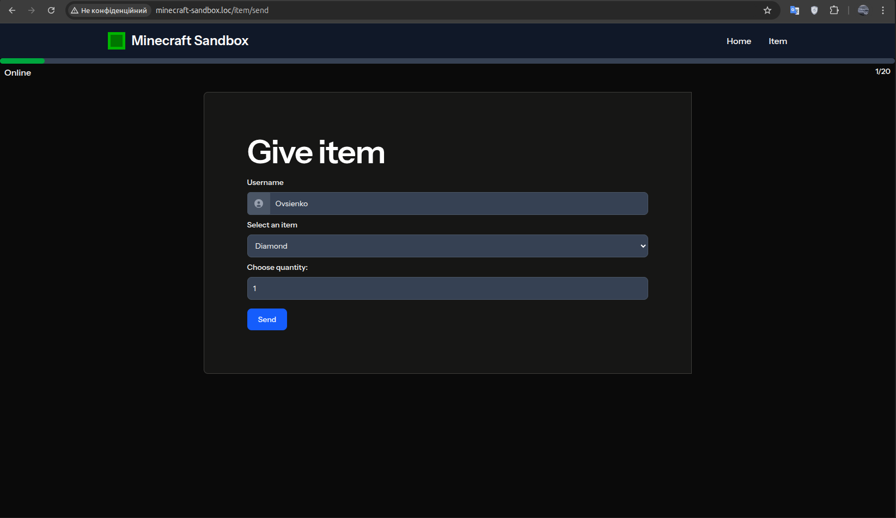

# Minecraft Sandbox – Laravel Dashboard for Server Management

**Minecraft Sandbox** is a Laravel-based web application for monitoring and interacting with a Minecraft server via RCON commands.  
It uses a custom microservice package – [minecraft-rcon](https://github.com/vovsi/minecraft-rcon) – to execute RCON commands and display real-time server stats.

---

## 🎮 Features (Current State)

- 📊 Real-time online player statistics (displayed in a progress bar) (via webhook integration)
- 🎒 Give items to players via RCON
- ⚡ Redis-powered caching for fast server data retrieval
- ✅ Integration with custom RCON package: [`minecraft-rcon`](https://github.com/vovsi/minecraft-rcon)

---

## 🛠 Tech Stack

- **Laravel 12** (PHP ^8.4)
- **Redis** – caching for player stats
- **MySQL 8.0** – default DB, not yet used
- **Nginx 1.23** – production-like server
- **Vite** – modern asset bundling
- **Docker Compose** – for local development

---

## 🚀 Getting Started (Docker)

### Prerequisites

- Docker + Docker Compose

### Setup

```bash
git clone https://github.com/vovsi/minecraft-sandbox.git
cd minecraft-sandbox
cp .env.example .env
docker-compose up -d --build
```

The app will be available at:
📍 http://localhost

## Useful Commands

docker exec -it php bash             # access PHP container
php artisan migrate                  # run migrations (optional)
php artisan key:generate             # if not done automatically

## 📸 UI Preview



*Above: Item send page with online player statistics (displayed in a progress bar)*

## 📄 License

MIT – Fork it, break it, rebuild it in Redstone ❤️
